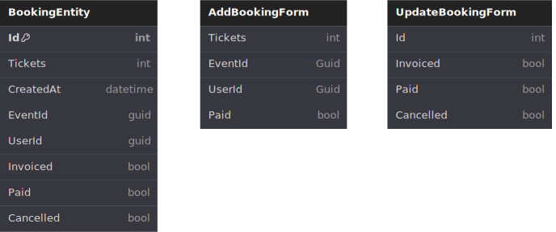

# Bookings Service

## Entity and form models:



## API calls examples:

### GET Bookings

https://localhost:7133/api/bookings

### GET Booking

https://localhost:7133/api/bookings/{bookingId}

ex: https://localhost:7133/api/bookings/1

### GET Bookings by userId

https://localhost:7133/api/bookings/user/{userId}

ex: https://localhost:7133/api/bookings/user/0909838e-9bf9-4e26-a544-aa2a3ef9e11f

### GET Bookings by eventId

https://localhost:7133/api/bookings/event/{eventId}

ex: https://localhost:7133/api/bookings/event/401a5bd2-081f-4ac9-baee-070b32d46f2b

### POST Booking

https://localhost:7133/api/bookings

Body - raw json:

```
{
    "tickets": 7,
    "EventId": "f5292e21-31e7-400e-964a-56f3ecd4c67c",
    "UserId": "0909838e-9bf9-4e26-a544-aa2a3ef9e11f",
    "Paid": false
}
```

### PUT Booking

https://localhost:7133/api/bookings

Body - raw json:

```
{
    "Id": 1,
    "Invoiced": false,
    "Paid": true,
    "Cancelled": false
}
```
